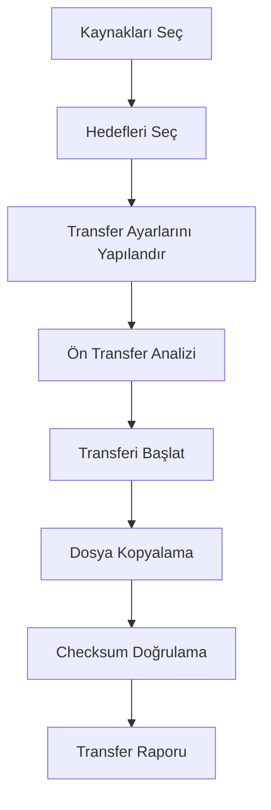
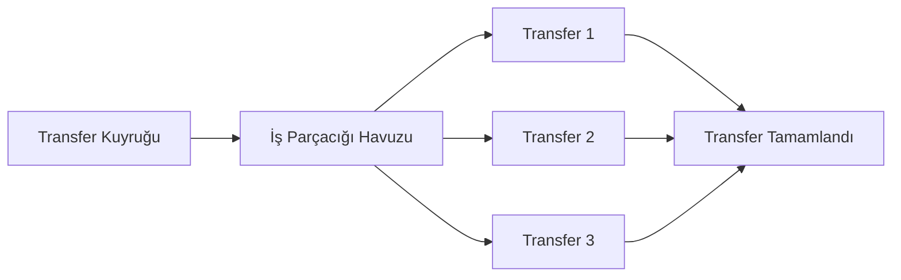

# MediaForge: Medya Transfer İş Akışı

Bu doküman, MediaForge uygulamasının medya transfer iş akışını ve bu süreçte kullanılan temel bileşenleri açıklar.

## İş Akışı Genel Bakış

MediaForge'un temel işlevi, dijital medya dosyalarını bir kaynaktan bir veya daha fazla hedefe güvenli bir şekilde transfer etmektir. Bu iş akışı, aşağıdaki temel adımlardan oluşur:

## Detaylı İş Akışı Adımları

### 1. Kaynak Seçimi
- Kullanıcı, sol panelde görüntülenen mevcut disklerden bir veya daha fazla kaynak seçer
- Kaynaklar genellikle kamera kartları, hafıza kartları veya diğer taşınabilir medyalardır
- Her kaynak için dosya sistemi hiyerarşisi görüntülenir
- Kullanıcı, tüm kaynağı veya belirli klasörleri/dosyaları seçebilir

### 2. Hedef Seçimi
- Kullanıcı, sağ panelde görüntülenen mevcut disklerden bir veya daha fazla hedef seçer
- Hedefler genellikle harici sabit diskler, RAID sistemleri veya NAS cihazlarıdır
- Her hedef için mevcut alan ve disk durumu gösterilir
- Kullanıcı, hedef klasörü belirleyebilir veya varsayılan yolu kullanabilir

### 3. Transfer Ayarları
- Kullanıcı, aşağıdaki transfer ayarlarını belirler:
  - **Alt Klasör Oluşturma:** Tarih, proje adı veya özel bir ad ile alt klasör oluşturma
  - **Checksum Metodu:** xxHash64 (hızlı), MD5 (orta), SHA-256 (güvenli) seçenekleri
  - **MHL Oluşturma:** Media Hash List dosyası oluşturma seçeneği
  - **Transfer Modu:** Standart, Arşiv veya Hızlı mod seçenekleri
  - **Sistem Dosyalarını Dahil Etme:** macOS'a özel sistem dosyalarını (._*, .DS_Store) dahil edip etmeme
  - **Mevcut Dosyaları Atla:** Hedefteki mevcut dosyaları atlama veya değiştirme seçeneği

### 4. Ön Transfer Analizi
- Transfer başlatılmadan önce, sistem aşağıdaki analizleri yapar:
  - Toplam dosya sayısı ve boyutu hesaplanır
  - Hedeflerdeki mevcut alan kontrolü yapılır
  - Muhtemel dosya çakışmaları belirlenir
  - Erişim izinleri kontrol edilir
  - Tahmini transfer süresi hesaplanır

### 5. Transfer Süreci
- Dosya kopyalama işlemi başlar ve ilerleme durumu gösterilir
- Dosyalar chunk'lar halinde kopyalanır (bellek kullanımını optimize etmek için)
- Transfer sırasında, sistem şu bilgileri gösterir:
  - İlerleme çubuğu (toplam ve geçerli dosya için)
  - Transfer hızı (MB/s)
  - Kalan süre
  - Aktarılan dosya sayısı ve boyutu

### 6. Doğrulama Süreci
- Tüm dosyalar kopyalandıktan sonra, doğrulama süreci başlar
- Her dosya için checksum değeri hesaplanır (kaynak ve hedefte)
- Checksum değerleri karşılaştırılır
- Eşleşme durumu gösterilir (başarılı/başarısız)
- İsteğe bağlı olarak MHL dosyası oluşturulur

### 7. Transfer Raporu
- Transfer tamamlandığında, detaylı bir rapor oluşturulur
- Rapor şu bilgileri içerir:
  - Transfer özeti (toplam dosya, boyut, süre)
  - Başarılı/başarısız transferlerin listesi
  - Doğrulama sonuçları
  - Varsa hata mesajları ve çözüm önerileri
  - Disk ve dosya bilgileri

## Paralel Transfer Yönetimi

MediaForge, birden fazla transfer işlemini paralel olarak yürütebilir:

- Maksimum paralel transfer sayısı ayarlardan yapılandırılabilir (varsayılan: 3)
- Her transfer işlemi ayrı bir iş parçacığında çalışır
- Sistem kaynakları (CPU, bellek, disk I/O) izlenir ve dengelenir
- Transfer önceliği belirleme seçeneği mevcuttur

## Hata İşleme ve Kurtarma

MediaForge, transfer sırasında oluşabilecek çeşitli hataları işlemek için sağlam bir mekanizmaya sahiptir:

### Olası Hata Senaryoları
- Disk çıkarılması veya bağlantı kesilmesi
- İzin sorunları
- Yetersiz disk alanı
- Dosya sistemi hataları
- Checksum doğrulama başarısızlıkları

### Kurtarma Mekanizmaları
- Her dosya transferi için checkpoint oluşturma
- Kesinti sonrası kaldığı yerden devam edebilme
- Otomatik yeniden deneme seçeneği
- Hata raporlama ve günlük tutma
- Kullanıcı dostu hata mesajları ve çözüm önerileri

## Özel Durum İş Akışları

### Preset Kullanımı
- Kullanıcılar sık kullanılan transfer yapılandırmalarını preset olarak kaydedebilir
- Presetler, tüm transfer ayarlarını içerir
- Proje veya kamera bazlı presetler oluşturulabilir

### Zamanlama ve Otomasyon
- Transferler belirli bir zamanda başlatılacak şekilde programlanabilir
- Belirli bir disk bağlandığında otomatik transfer başlatılabilir
- Transfer tamamlandığında otomatik eylemler (bildirim, rapor gönderme vb.) yapılandırılabilir

### Metadata Analizi
- Gelecek sürümlerde, transfer sırasında metadata analizi yapılabilecek
- Kamera modeli, çekim tarihi, lens bilgisi gibi metadata bilgileri çıkarılabilecek
- Metadata bazlı otomatik klasör yapısı oluşturulabilecek

Bu doküman, MediaForge uygulamasının temel medya transfer iş akışını açıklamaktadır. Proje geliştikçe ve yeni özellikler eklendikçe güncellenecektir. 